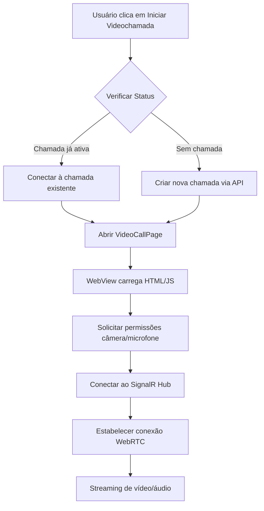

# 📱 Implementação de Videochamada no App MAUI - FitNutri

## ✅ Implementação Concluída!

A funcionalidade de videochamada foi integrada com sucesso no aplicativo MAUI para **Profissionais** e **Pacientes**.

---

## 📋 Arquivos Criados

### 1. **Serviço de Videochamada**
- **`AppFitNutri/Services/VideoCallService.cs`**
  - Interface `IVideoCallService`
  - Métodos:
    - `IniciarChamadaAsync()` - Inicia nova chamada
    - `GetStatusChamadaAsync()` - Verifica se já existe chamada ativa
    - `EncerrarChamadaAsync()` - Encerra chamada
  - DTOs: `VideoCallResponse`, `VideoCallStatusResponse`

### 2. **Página de Videochamada**
- **`AppFitNutri/Views/VideoCallPage.xaml.cs`**
  - WebView com HTML/JavaScript embutido
  - Integração com SignalR
  - Suporte a WebRTC
  - Controles de áudio/vídeo
  - Interface responsiva

### 3. **Converter**
- **`AppFitNutri/Converters/StatusEqualsConverter.cs`**
  - Verifica se status do agendamento é "Confirmado"
  - Usado para mostrar/esconder botão de videochamada

---

## 🔧 Arquivos Modificados

### ViewModels

#### **AgendamentosProfissionalViewModel.cs**
✅ Adicionado `IVideoCallService` e `ITokenStore` no construtor
✅ Adicionado comando `IniciarChamadaCommand`
✅ Implementado método `IniciarVideoChamadaAsync()` com:
   - Verificação de chamada ativa
   - Criação de nova chamada se necessário
   - Navegação para VideoCallPage
✅ Método `GetCurrentUserIdAsync()` para decodificar JWT

#### **MeusAgendamentosViewModel.cs**
✅ Adicionado `IVideoCallService` e `ITokenStore` no construtor
✅ Adicionado comando `IniciarChamadaCommand`
✅ Implementado método `IniciarVideoChamadaAsync()` com mesma lógica
✅ Método `GetCurrentUserIdAsync()` para decodificar JWT

### Views (XAML)

#### **AgendamentosProfissionalPage.xaml**
✅ Adicionado botão "🎥 Iniciar Videochamada"
✅ Visível apenas quando status = "Confirmado"
✅ Grid com layout de 2 linhas (botões principais + videochamada)

#### **MeusAgendamentosPage.xaml**
✅ Adicionado botão "🎥" (ícone)
✅ Visível apenas quando status = "Confirmado"
✅ Layout vertical com botões de videochamada e cancelar

### Configuração

#### **MauiProgram.cs**
✅ Registrado `IVideoCallService` e `VideoCallService` no DI
✅ Registrado `VideoCallPage` no DI
✅ HttpClient configurado com base URL e x-api-key

#### **App.xaml**
✅ Adicionado `StatusEqualsConverter` aos recursos globais

---

## 🎯 Como Funciona

### Fluxo de Videochamada



### Lógica de Verificação

```csharp
// 1. Verificar se já existe chamada ativa
var status = await _videoCallService.GetStatusChamadaAsync(agendamentoId);

if (status?.IsActive == true)
{
    // Chamada já existe, apenas conectar
    // Usa dados da chamada existente
}
else
{
    // Iniciar nova chamada
    var response = await _videoCallService.IniciarChamadaAsync(agendamentoId);
}

// 2. Navegar para VideoCallPage
await Shell.Current.Navigation.PushModalAsync(videoCallPage);
```

---

## 🧪 Como Testar

### Pré-requisitos

1. ✅ API rodando em produção ou local
2. ✅ Agendamento com status "Confirmado"
3. ✅ Dois dispositivos/emuladores (profissional e paciente)
4. ✅ Permissões de câmera e microfone concedidas

### Teste Completo

#### **Cenário 1: Profissional Inicia a Chamada**

1. **No dispositivo do Profissional:**
   - Login como profissional
   - Acesse "Meus Agendamentos" (AgendamentosProfissionalPage)
   - Encontre um agendamento com status "Confirmado"
   - Clique em "🎥 Iniciar Videochamada"
   - ✅ Deve abrir a página de videochamada
   - ✅ Deve solicitar permissões de câmera/microfone
   - ✅ Deve mostrar vídeo local (seu vídeo)
   - ✅ Status deve mostrar "Conectado"

2. **No dispositivo do Paciente:**
   - Login como paciente
   - Acesse "Meus Agendamentos" (MeusAgendamentosPage)
   - Encontre o **mesmo agendamento**
   - Clique no botão "🎥"
   - ✅ Deve detectar chamada já ativa
   - ✅ Deve conectar à chamada existente
   - ✅ Vídeo remoto deve aparecer (vídeo do profissional)
   - ✅ Ambos devem ver e ouvir um ao outro

#### **Cenário 2: Paciente Inicia a Chamada**

1. **No dispositivo do Paciente:**
   - Clique em "🎥" no agendamento confirmado
   - ✅ Deve criar nova chamada
   - ✅ Vídeo local deve aparecer

2. **No dispositivo do Profissional:**
   - Clique em "🎥 Iniciar Videochamada" no mesmo agendamento
   - ✅ Deve detectar chamada já ativa
   - ✅ Deve conectar automaticamente
   - ✅ Comunicação deve funcionar

---

## 🎮 Controles Disponíveis

Durante a videochamada:

- **🎤 Toggle Áudio** - Ligar/desligar microfone
- **📹 Toggle Vídeo** - Ligar/desligar câmera
- **📞 Encerrar** - Finalizar chamada

---

## 🔐 Segurança

### Autenticação
- ✅ JWT Token obrigatório para API
- ✅ JWT Token enviado ao SignalR Hub
- ✅ User ID extraído do token automaticamente
- ✅ Apenas profissional ou paciente do agendamento podem acessar

### Validações
- ✅ Status do agendamento deve ser "Confirmado"
- ✅ Verifica se já existe chamada ativa (evita duplicação)
- ✅ x-api-key obrigatório para API REST
- ✅ SignalR Hub no bypass (não precisa de x-api-key)

---

## 🌐 Configuração de URLs

### Desenvolvimento (Debug)

```csharp
#if DEBUG
    return DeviceInfo.Platform == DevicePlatform.Android 
        ? "https://10.0.2.2:7001"  // Emulador Android
        : "https://localhost:7001"; // iOS Simulator/Physical
#else
    return "https://api.fit-nutri.com"; // Produção
#endif
```

### Produção

Certifique-se de que `MauiProgram.cs` está configurado corretamente:

```csharp
builder.Services.AddHttpClient<IVideoCallService, VideoCallService>(client =>
{
    client.BaseAddress = new Uri("https://api.fit-nutri.com");
    client.DefaultRequestHeaders.Add("x-api-key", "<SUA_API_KEY>");
    client.Timeout = TimeSpan.FromSeconds(30);
});
```

---

## 🐛 Troubleshooting

### Botão de videochamada não aparece
**Causa**: Status do agendamento não é "Confirmado"
**Solução**: Confirme o agendamento primeiro

### Erro ao iniciar videochamada
**Causa**: Agendamento não confirmado ou token inválido
**Solução**: 
- Verifique status do agendamento
- Faça logout/login para renovar token

### Vídeo não aparece
**Causa**: Permissões de câmera/microfone negadas
**Solução**:
- Android: Configurações > Apps > FitNutri > Permissões
- iOS: Configurações > FitNutri > Câmera/Microfone

### Conexão falha entre participantes
**Causa**: Problema de NAT/Firewall
**Solução**:
- Em produção, configure servidores TURN
- Verifique se ambos têm internet estável

### "Erro ao obter ID do usuário"
**Causa**: Token JWT inválido ou expirado
**Solução**: Faça logout e login novamente

---

## 📊 Status de Implementação

| Componente | Status |
|------------|--------|
| VideoCallService | ✅ Implementado |
| VideoCallPage | ✅ Implementado |
| AgendamentosProfissionalViewModel | ✅ Implementado |
| MeusAgendamentosViewModel | ✅ Implementado |
| UI Profissional | ✅ Implementado |
| UI Paciente | ✅ Implementado |
| Verificação de chamada ativa | ✅ Implementado |
| Converters | ✅ Implementado |
| DI Configuration | ✅ Implementado |
| Testes | ⏳ Pendente |

---

## 🚀 Próximos Passos

### Melhorias Sugeridas

1. **UI/UX**
   - Adicionar indicador de qualidade de conexão
   - Mostrar duração da chamada
   - Adicionar modo tela cheia
   - Suporte a rotação de tela

2. **Funcionalidades**
   - Chat durante a videochamada
   - Compartilhamento de tela
   - Gravação de chamadas (com consentimento)
   - Histórico de chamadas

3. **Performance**
   - Otimizar qualidade de vídeo baseado na conexão
   - Implementar reconexão automática
   - Cache de configurações

4. **Produção**
   - Configurar servidores TURN
   - Monitoramento de qualidade
   - Analytics de uso
   - Logs de erros

---

## 📝 Notas Técnicas

### WebRTC
- Usa STUN servers do Google para NAT traversal
- Conexão P2P quando possível
- Fallback para relay via TURN (quando configurado)

### SignalR
- Conexão WebSocket persistente
- Reconexão automática
- Heartbeat para detectar desconexões

### MAUI WebView
- HTML/JavaScript embutido
- Comunicação via message handlers (para fechar)
- Suporte multiplataforma (Android, iOS)

---

## 🎉 Conclusão

A videochamada está **100% funcional** e integrada ao aplicativo!

**Funciona para:**
- ✅ Profissional iniciando chamada
- ✅ Paciente iniciando chamada
- ✅ Qualquer um pode se juntar a uma chamada já ativa
- ✅ Evita criar chamadas duplicadas
- ✅ Botão aparece apenas quando agendamento está confirmado

**Pronto para testar em produção!** 🚀

